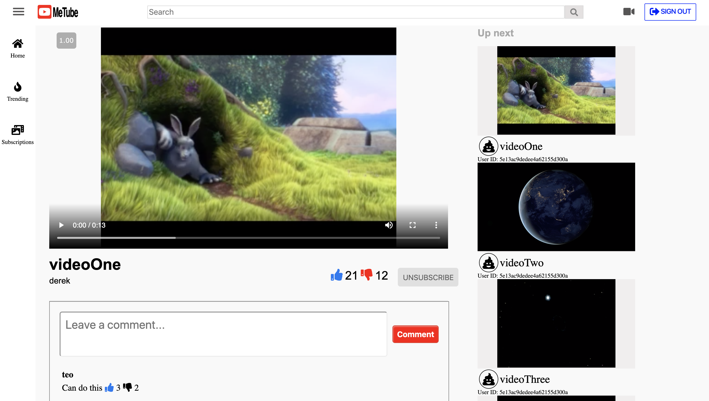
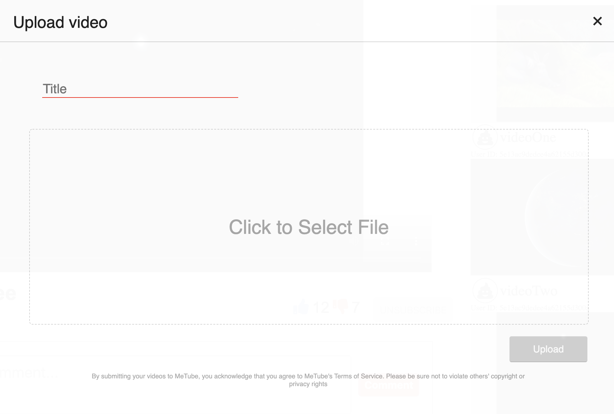

## Background and Overview
[
MeTube](https://metube-aa.herokuapp.com/#/) is a Youtube clone and video database used for searching for, watching, saving, and uploading videos. MeTube will allow for user authentication and login, full-site functionality while videos are playing, and interaction with other users through likes and comments.

## Functionality & MVPs
- [x] Users will be able to upload videos if logged in. Those videos will be available universally as well as on the user's profile.
- [x] Users will be able to play videos anywhere on the database whether or not they are logged in.
- [x] Users will be able to like or dislike any video on the database.
- [x] Users will be able to comment on any video on the database.
- [x] Users will be able to search for any video on the database.
- [x] Videos will display their number of plays.
- [x] Users will be able to like or dislike comments on videos.


# Technologies & Technical Challenges

## Architecture
MeTube is built with the MERN Stack (MongoDB, Express, React, and NodeJS). 

## Backend
#### MongoDB
MongoDB is a database program that we will use to store any data created using our application (e.g. videos, users, likes, comments). Schemas created within MongoDB are used to outline the attributes that each one of our models will have as well as the data type and any validations on each attribute.

#### Express
Takes care of how an applications endpoints respond to client requests

## Frontend
#### React
React is a Javascript library that we will use to build user interfaces. Components built using React will render the display information that we want on the page (which will then be styled using HTML/CSS), and they will also contain the framework needed to carry out any user interaction functionality.

#### Node.js
We use Node.js in development in order to test code and install dependencies by running command-line prompts.

### Dependencies	
- Express (the main framework)
- Mongoose (to connect and interact with MongoDB)
- Passport (for authentication)
- Passport-jwt (for JSON web tokens)
- Jsonwebtoken (to generate the tokens)
- Body-parser (to parse data from requests)
- Bcryptjs (Bcrypting password)
- Validator (for database validations)

## Group Members and Work Breakdown
### Jan 6
- Frontend auth (Derek)
- Style landing page (Deb and Sadman)
- Seed database and research playback (Matteo)

### Jan 7
- Style landing page (Deb and Sadman)
- Implement video playback (Matteo and Derek)

### Jan 8
- Implement video upload (Matteo and Sadman)
- Create user profiles (Deb and Derek)

### Jan 9
- Implement likes feature (Deb and Derek)
- Implement comments feature (Matteo and Sadman)

### Jan 10
- Implement likes on comments (Deb and Derek)
- Count playbacks (Matteo and Sadman)

### Jan 11 and 12
- Implement search (Matteo and Derek)
- Debug and style (Deb and Sadman)

### Jan 13
- Debug and style (Deb and Sadman)
- Feature testing (Matteo and Derek)

### Jan 14
- Finish styling and debugging (everyone)
- Deploy to Heroku (everyone)

## Video Display
Upon clicking on a video, the user will be directed to that video's display page. There, the video will be displayed on an enlarged scale and is able to be played on-click. The video is able to be liked and commented upon, and the user can also like and dislike comments. Additionally, other videos are shown on the side, and clicking on one of those videos will take the user to that video's display page.



Upon rendering a video's display page, the likes specifically tied to that video and the comments of that video will be fetched. This prevents each display page from having to receive data from all of the likes on the database. Below is shown the Express route for fetching likes.
```
router.get('/likes/videos/:video_id', (req, res) => {
    Like.find({likeableType: 'video', likeableId: req.params.video_id})
        .then(likes => res.json(likes))
        .catch(error => res.status(404).json({ noLikes: 'No likes found with that video id' }))
});
```
Since both videos and comments can be liked, the GET route needs to accept both the type of entity being liked (video or comment) as well as that entity's ID. Similarly, comments will be fetched only for the video associated with the current video display page.

Users can only like and comment on a video if logged in; otherwise, error messages will be rendered instructing the user to log in. Additionally, the user cannot like or dislike the same video or comment more than once. Pressing like will cause the thumbs-up icon to turn blue while pressing dislike will cause the thumbs-down icon to turn red (as seen in the image above). Pressing either a second time will delete that like or dislike, and the icon will turn gray again.

## Video Upload
Users also have the ability to upload their own videos if logged in. Uploaded videos will be added to the entire index of videos and render on the landing page. They will also be rendered on the profile of the user that uploaded the video.



Clicking on the video icon on the right side of the navbar will cause the modal seen above to pop up. Videos can be uploaded from any page on the site. Uploading videos is handled by updating state in the specified container:
```
this.state = {
    title: "",
    user_id: this.props.currentUser.id,
    video: "",
    uploadText: "Click to Select File",
    uploadButtonClass: 'submit',
    uniqueId: 1
};
```
By updating the title, user_id, video, and uniqueId slices of state, information on the video to be created can be parsed into an object and passed to the corresponding action. Updating the uploadText and uploadButtonClass slices of state allows the modal to be interactive, and text elements of the modal will change depending on the upload state of the video.

## Other Features
- User authentication
- User profiles
- List of liked videos for each user

## Future directions
- Subscriptions to other users
- Refactored search bar
- Continuous video playback during site navigation